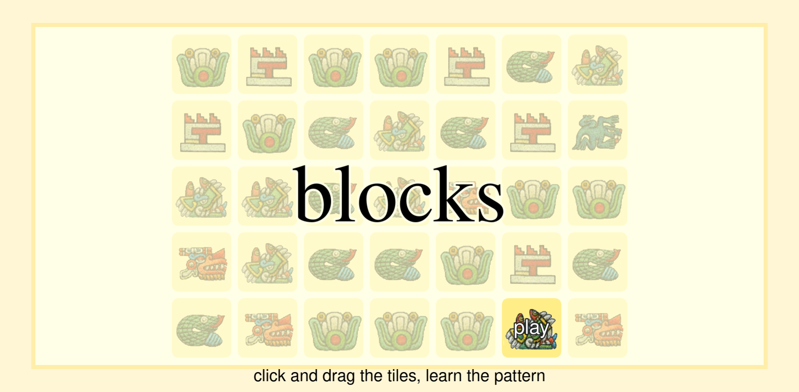
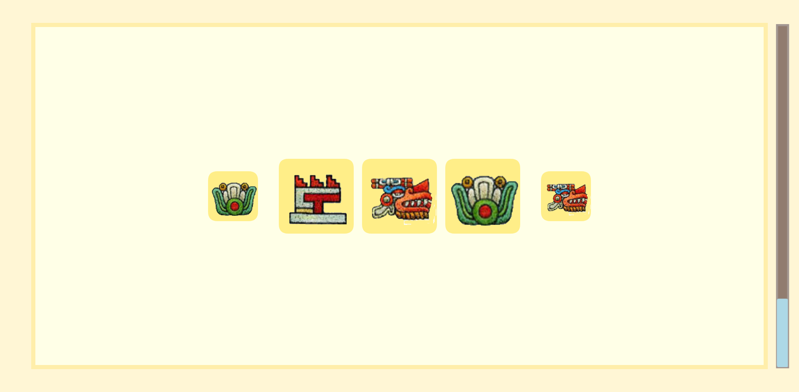
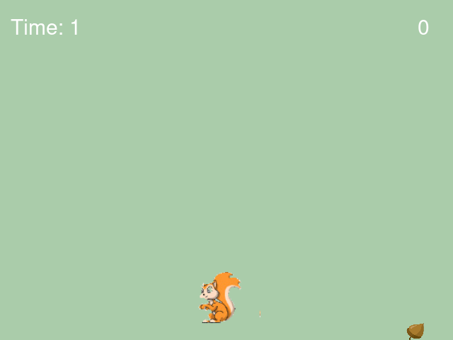
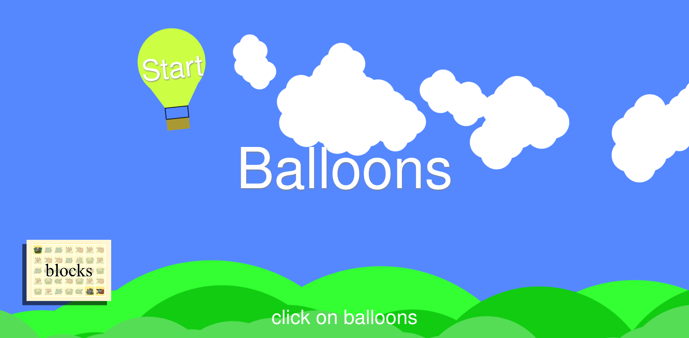
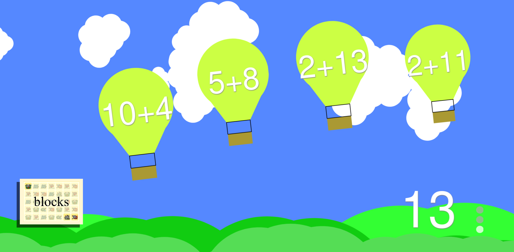

# Artificial Grammar Learning Game Suite

These are three quick game prototypes for testing ideas about Artificial Grammar Learning. I created them early in my PhD research.

[Artificial grammer learning](https://en.wikipedia.org/wiki/Artificial_grammar_learning) is a paradgim for studying language learning. Participants are given a task that requires them to learn the rules of an artificial grammar. The learnability of grammars with different properties can be compared.

I did not take these ideas further in my research so these games never got beyond prototypes.

## Blocks

[Play Blocks online](http://davidgundry.github.io/AGL-Suite/agl-blocks)

In blocks, players have to rearrange a linear sequence of blocks to get them into the correct order. They score points and progress for each level they complete. The intention was to wrap this in a fiction about an Indiana Jones-style explorer solving puzzles to progress into an Aztec pyramid.

## Run

[Play Run online](http://davidgundry.github.io/AGL-Suite/agl-run)

Run was a prototype for reaction-based learning. This is a very simple game where the player has to move either left or right to collect a fallen acorn. Acorns fall to the left or right of the player determined by an artificial grammar. The intention was to measure reaction times to observe if players unconsiously learned the grammar.

## Balloons

[Play Balloons online](http://davidgundry.github.io/AGL-Suite/agl-balloons)

Balloons is a slightly unrelated educational game idea. Players make true-or-false judgements on balloons as they glide across the screen.

Originally the intention was to present strings generated by an artificial grammar, and players would learn the rules of the grammar through trial and error.

